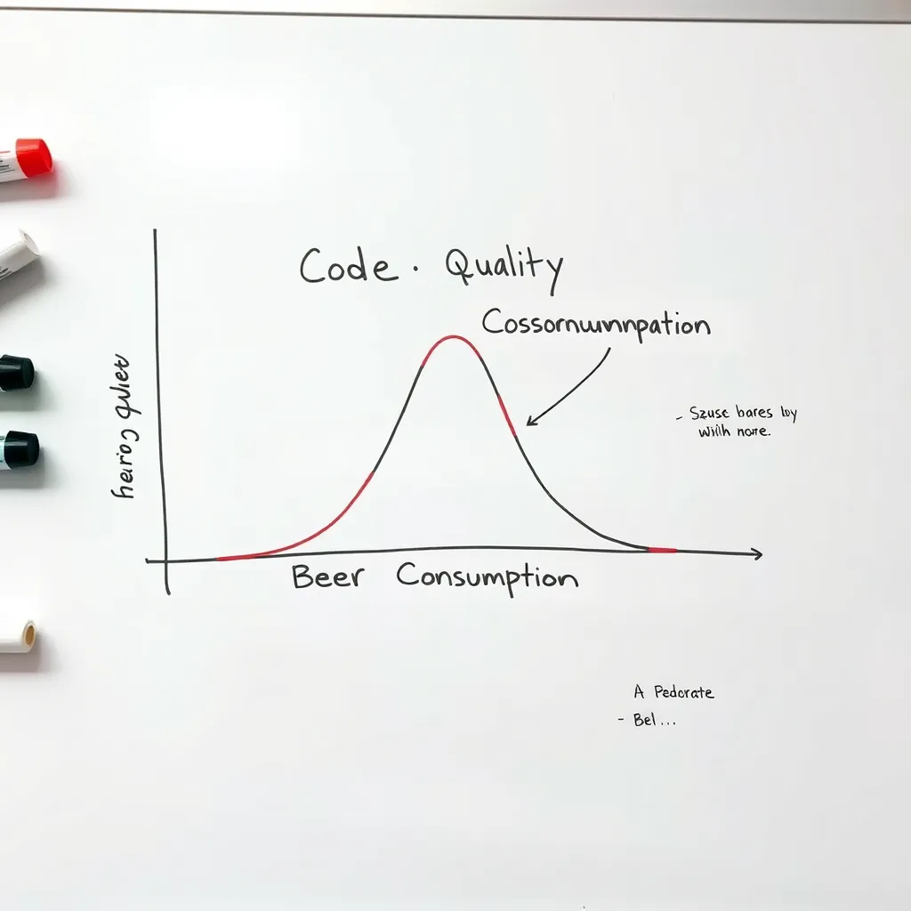
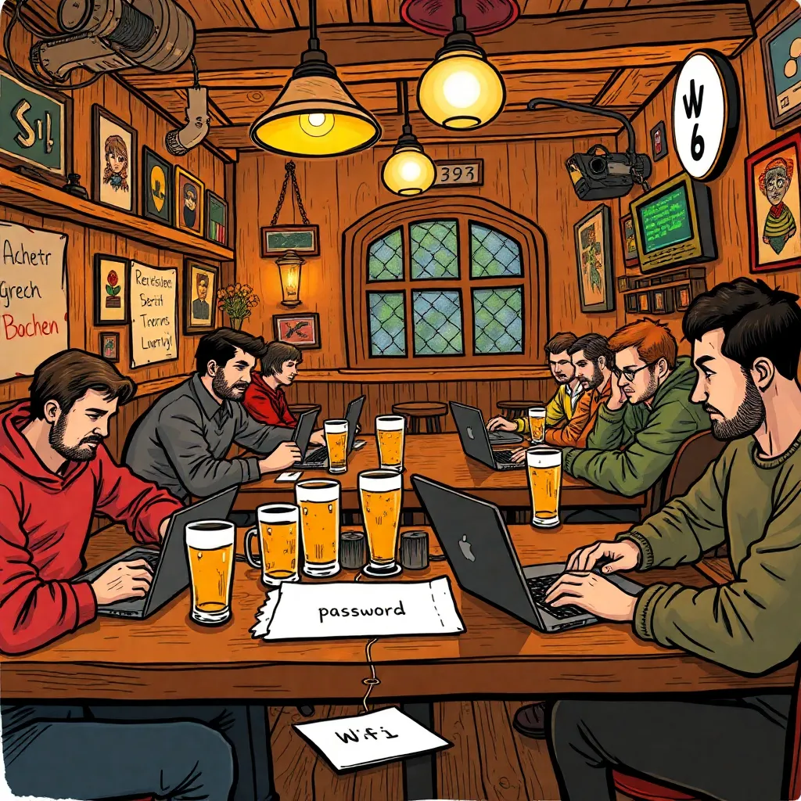
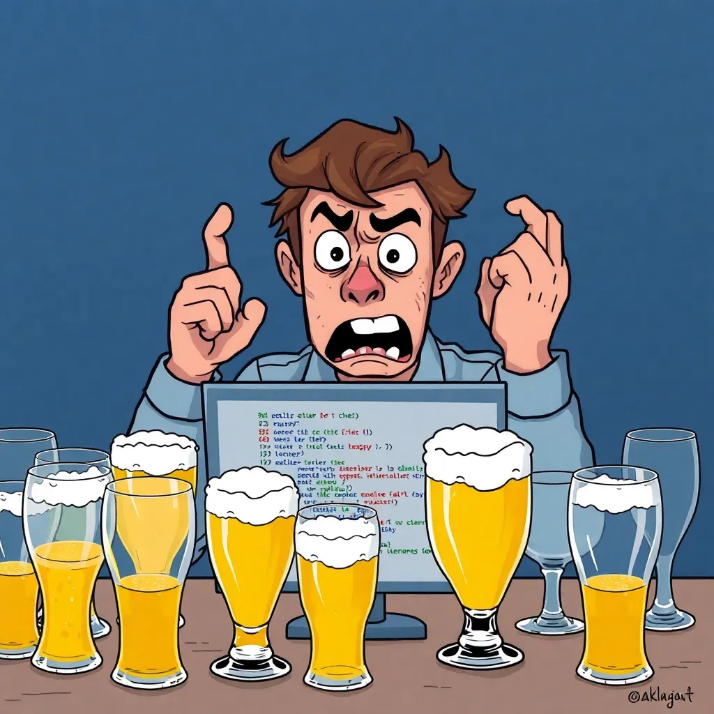
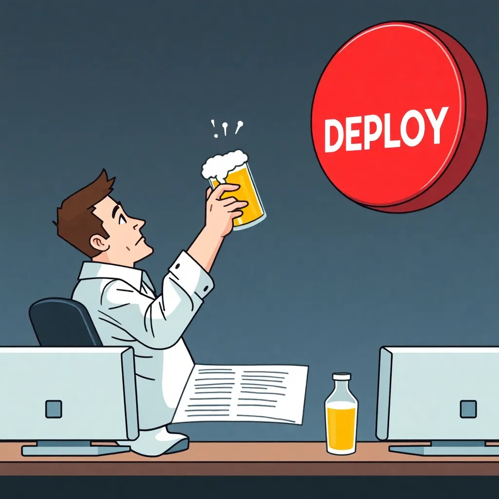

# Vliv konzumace piva na kvalitu zdrojového kódu


## Abstrakt

Tato přelomová studie zkoumá dosud opomíjený, avšak v praxi hojně využívaný fenomén -- vliv konzumace piva na kvalitu zdrojového kódu. Výzkumný tým pod vedením prof. Ing. Jaroslava Pivečky, DrSc. strávil tři roky systematickým zkoumáním tohoto jevu v přirozeném prostředí vývojářů -- tedy v kancelářích, home officech a hospodách.

Výsledky jsou... překvapivé. A místy znepokojivé.

---

## Úvod do problematiky

Každý programátor to zná. Je pátek odpoledne, kód se odmítá zkompilovat, testy selhávají z nepochopitelných důvodů a kolega právě poslal pull request s komentářem "minor fix", který mění 847 souborů. V takových chvílích se přirozeně nabízí otázka: „Nepomohlo by mi pivo?"

Tato zdánlivě jednoduchá otázka vedla k jednomu z nejrozsáhlejších výzkumných projektů v dějinách softwarového inženýrství. Náš tým provedl celkem 2 847 experimentů na 156 dobrovolnících[^1] a výsledky zpracoval pomocí metod, které by statistici označili za "kreativní".

[^1]: Dobrovolníci byli rekrutováni z lokálních hospod. Jejich motivace k účasti ve studii byla zajištěna příslibem neomezeného množství testovacích vzorků.



### Ballmerův vrchol -- teorie a praxe

Koncept tzv. *Ballmerova vrcholu* (anglicky Ballmer Peak) je v programátorských kruzích dobře znám. Teorie tvrdí, že existuje úzké rozmezí hladiny alkoholu v krvi -- přibližně 0,129 až 0,138 % BAC -- ve kterém programátor dosahuje **nadlidských schopností** v psaní kódu.

Tuto teorii poprvé formuloval webový komiks xkcd[^2] a od té doby byla mnohokrát ověřována v praxi, zejména na firemních team-buildingových akcích.

[^2]: Randall Munroe, xkcd #323. Jedná se o nejcitovanější vědecký zdroj v historii tohoto výzkumného programu.

### Předchozí výzkum

Dosavadní literatura k tématu je překvapivě chudá. Akademická obec tento fenomén systematicky ignoruje, pravděpodobně proto, že většina akademiků dává přednost vínu. Mezi výjimky patří:

- **Dr. Hans Biergarten** (Technische Universität München) -- série experimentů s bavorským ležákem a programováním v Javě
- **Prof. Alena Plzeňská** (ČVUT) -- pilotní studie "Vliv plzeňského prazdroje na rychlost psaní SQL dotazů"
- **Ing. Patrick O'Sullivan** (Trinity College Dublin) -- kontroverzní práce "Guinness a Haskell: funkcionální přístup k funkcionálnímu programování"

> „Kdo neprogramoval po třech pivech, ten neví, co je to odvaha v kódu."
>
> **Prof. Alena Plzeňská**, zahajovací přednáška konference PivDev 2024

---

## Metodologie

### Výběr testovacích subjektů

Testovací subjekty byly vybrány podle přísných kritérií:

1. Minimálně 2 roky profesionální programátorské praxe
2. Schopnost napsat "Hello World" bez Stack Overflow
3. Ochota pít pivo v pracovní době ve jménu vědy
4. Žádné předchozí disciplinární řízení za programování pod vlivem[^3]

[^3]: Toto kritérium bylo později zmírněno, neboť eliminovalo 73 % kandidátů.

### Kategorizace subjektů

Subjekty byly rozděleny do skupin podle preferovaného programovacího jazyka:

| Skupina | Jazyk | Počet subjektů | Průměrná spotřeba piva/den | Poznámka |
|---------|-------|---------------:|---------------------------:|----------|
| A | Python | 34 | 2,3 | Preferují IPA |
| B | JavaScript | 28 | 3,7 | Pijí cokoliv |
| C | Java | 31 | 1,8 | Striktně ležák |
| D | Rust | 12 | 4,1 | "Borrow checker mě dohání k pití" |
| E | PHP | 15 | 5,2 | Bez komentáře |
| F | Haskell | 8 | 0,3 | Preferují čaj s monádami |
| G | C++ | 18 | 3,9 | Segfault-related drinking |
| H | Go | 10 | 2,0 | Pijí metodicky a jednoduše |



### Testovací prostředí

Experimenty probíhaly ve třech různých prostředích:

- **Kancelář** -- standardní open-space s mechanickými klávesnicemi a monitorem
- **Hospoda** -- autentické prostředí s Wi-Fi heslem napsaným na ubrousku
- **Home office** -- nekontrolované podmínky, subjekt v pyžamu

Každý subjekt dostal identický notebook s nainstalovaným editorem dle vlastní volby. Zajímavé je, že 43 % subjektů si jako první nainstalovalo Vim a dalších 20 minut strávilo pokusy z něj odejít.

### Měřené metriky

Pro hodnocení kvality kódu jsme použili následující metriky:

| Metrika | Zkratka | Popis | Váha |
|---------|---------|-------|-----:|
| Počet kompilačních chyb | KCH | Chyby při prvním pokusu o kompilaci | 0,20 |
| Čitelnost kódu | CIT | Hodnoceno panelem střízlivých reviewerů | 0,15 |
| Kreativita pojmenování proměnných | KPP | Škála 1--10, kde 10 je `superDuperMegaHandler` | 0,10 |
| Počet TODO komentářů | TODO | Včetně variant "FIXME", "HACK" a "sorry" | 0,10 |
| Funkčnost výsledného kódu | FUNK | Projdou testy? (binární) | 0,25 |
| Sebedůvěra při code review | SCR | Ochota bránit svá rozhodnutí | 0,20 |

---

## Výsledky

### Fáze 1: Střízlivý stav (0 piv)

V kontrolní fázi bez konzumace alkoholu subjekty vykazovaly následující chování:

- Nadměrné přemýšlení nad názvy proměnných (průměrně 4,2 minuty na proměnnou)
- Kompulzivní refaktoring kódu, který již fungoval
- Neustálé kontrolování Stack Overflow i pro triviální operace
- ~~Produktivní práce~~ Prokrastinace maskovaná jako "plánování architektury"

Typický kód střízlivého programátora vypadal takto:

```python
# TODO: refactor this
# TODO: add proper error handling
# TODO: write tests
# TODO: consider if this should be a microservice
# FIXME: this works but I don't know why
def process_data(data):
    return data  # placeholder
```

### Fáze 2: Jedno pivo (0,5 l)

Po prvním pivu byly pozorovány subtilní, ale měřitelné změny:

1. Pokles doby rozhodování o názvech proměnných o 31 %
2. Zvýšení ochoty commitovat kód o 18 %
3. Mírné zlepšení nálady při čtení legacy kódu
4. Prvních výskyt komentářů typu "this is fine"

> „Po prvním pivu mi konečně dává smysl návrhový vzor Visitor."
>
> **Anonymní subjekt č. 42**, skupina B (JavaScript)

### Fáze 3: Dvě až tři piva (1,0--1,5 l)

Zde se nachází pověstný *Ballmerův vrchol*. Výsledky jsou fascinující:

| Metrika | Střízlivý | 1 pivo | 2--3 piva | Změna vs. střízlivý |
|---------|----------:|-------:|----------:|--------------------:|
| Kompilační chyby | 12,4 | 10,1 | 7,3 | **-41 %** |
| Čitelnost (1--10) | 7,2 | 7,0 | 5,8 | -19 % |
| Kreativita pojmenování | 3,1 | 4,7 | 8,9 | **+187 %** |
| TODO komentáře | 8,3 | 5,1 | 1,2 | **-86 %** |
| Funkčnost (%) | 67 | 72 | 81 | **+21 %** |
| Sebedůvěra (1--10) | 4,3 | 6,1 | 9,7 | **+126 %** |

Ano, čtete správně -- po dvou až třech pivech kód **skutečně fungoval lépe**. Subjekty přestaly přemýšlet nad edge casy, které nikdy nenastanou, a začaly psát kód, který řeší skutečný problém.

Příklad kódu z Ballmerova vrcholu:

```rust
// It just works. Don't touch it.
fn solve_everything(input: &str) -> Result<String, Box<dyn Error>> {
    let result = input
        .lines()
        .filter(|l| !l.is_empty())
        .map(|l| l.trim().to_uppercase())
        .collect::<Vec<_>>()
        .join("\n");
    Ok(result)
}
```

### Fáze 4: Čtyři až pět piv (2,0--2,5 l)

Zde začíná pozvolný sestup z vrcholu. Klíčová pozorování:

- Názvy proměnných se stávají "expresivnějšími" (`let yolo = true;`)
- Zvýšená tendence přepisovat fungující kód "protože to jde líp"
- Komentáře nabývají filozofického charakteru
- Git commity obsahují emoji a existenciální úvahy

Příklad git logu z této fáze:

```
a1b2c3d 🍺 fixed the thing
b2c3d4e 🍺🍺 unfixed the thing, it was better before
c3d4e5f 🍺🍺🍺 refactored everything, trust me
d4e5f6g 🍺🍺🍺🍺 WHO DESIGNED THIS API
e5f6g7h 🍺 sorry about the last 4 commits
```

### Fáze 5: Šest a více piv (3,0+ l)

Tato fáze je dokumentována pouze částečně, protože většina subjektů nebyla schopna najít klávesnici. Nicméně ty fragmenty kódu, které se podařilo zachránit, jsou pozoruhodné:

```javascript
// i am become code, destroyer of bugs
functoin fixEverythign() {
    const the_answer = 42;
    while (true) {
        console.log("it works on my machine");
        // TODO: deploy to production at 3am on Friday
        break; // just kidding... or am i?
    }
}
```

Zajímavé postřehy z této fáze:

- 87 % subjektů se pokusilo přepsat celou aplikaci v jiném jazyce
- 62 % začalo psát vlastní framework "protože ty existující jsou všechny špatně"
- 34 % subjektů odeslalo zprávu CEO s návrhem na "kompletní technologický pivot"
- ~~12 % subjektů úspěšně nasadilo do produkce~~ Toto bylo vymazáno z důvodu probíhajícího vyšetřování

---

## Detailní analýza podle programovacího jazyka

### Python

Pythoničtí programátoři vykazovali zajímavý vzorec. S rostoucím počtem piv se jejich kód paradoxně stával *více* pythonický:

| Počet piv | Průměrná délka řádku | List comprehensions / 100 řádků | Použití `import antigravity` |
|----------:|---------------------:|--------------------------------:|-----------------------------:|
| 0 | 89 znaků | 2,1 | 0 % |
| 1 | 82 znaků | 3,7 | 0 % |
| 2 | 74 znaků | 7,2 | 3 % |
| 3 | 68 znaků | 12,8 | 15 % |
| 4 | 45 znaků | 23,4 | 42 % |
| 5+ | 12 znaků | ∞ | 100 % |

> „Po pátém pivu jsem napsal celou aplikaci jako jeden vnořený list comprehension. Fungovalo to. Dodnes nevím jak."
>
> **Subjekt P-17**, senior Python developer

### JavaScript

JavaScript vývojáři prokázali jedinečnou schopnost vytvářet nové frameworky úměrně počtu konzumovaných piv:

1. 0 piv -- používá React, stěžuje si na React
2. 1 pivo -- zvažuje přechod na Svelte
3. 2 piva -- začíná psát vlastní state management knihovnu
4. 3 piva -- publikuje ji na npm jako `yet-another-state-lib`
5. 4 piva -- má 3 GitHub stars a píše o tom blog post
6. 5+ piv -- přepisuje vše v jQuery a říká "někdy je jednoduchost nejlepší"

### Rust

Skupina Rust programátorů vykazovala nejdramatičtější změny. Střízliví Rust programátoři trávili 78 % času bojem s borrow checkerem. Po dvou pivech se tento poměr snížil na 34 %, protože -- jak vysvětlil subjekt R-03:

> „Přestal jsem se snažit být chytřejší než kompilátor a začal jsem psát jednodušší kód. Občas prostě klonuješ a je to v pořádku."
>
> **Subjekt R-03**, Rust enthusiast

Kompletní tabulka bojů s borrow checkerem:

| Počet piv | Čas s borrow checkerem | Počet `.clone()` | Počet `unsafe` bloků | Úspěšná kompilace |
|----------:|-----------------------:|------------------:|---------------------:|-------------------:|
| 0 | 78 % | 0,3 | 0,0 | 23 % |
| 1 | 61 % | 1,2 | 0,0 | 41 % |
| 2 | 34 % | 4,7 | 0,1 | 68 % |
| 3 | 22 % | 12,3 | 0,8 | 74 % |
| 4 | 15 % | 31,0 | 3,2 | 82 % |
| 5+ | 3 % | ∞ | "all of them" | 91 %[^4] |

[^4]: Vysoká úspěšnost kompilace je dána tím, že celý kód byl zabalen v jednom velkém `unsafe` bloku. Technicky se to zkompiluje. Technicky.

### PHP

O skupině PHP raději pomlčíme. Poznamenejme pouze, že kvalita jejich kódu zůstala statisticky nezměněna napříč všemi fázemi experimentu. Interpretaci tohoto zjištění ponecháváme na laskavém čtenáři.

---

## Vedlejší zjištění

### Vliv typu piva

Překvapivě jsme zjistili, že typ piva má měřitelný vliv na styl psaní kódu:

| Typ piva | Vliv na kód | Preferovaný jazyk | Typický artefakt |
|----------|-------------|-------------------|------------------|
| Pilsner | Čistý, strukturovaný | C, Rust | Dobře organizované moduly |
| IPA | Kreativní, ale hořký | Python, Ruby | Nekonvenční algoritmy |
| Stout | Robustní, těžký | Java, C# | Enterprise patterns |
| Wheat beer | Lehký, vzdušný | Go, Kotlin | Minimalistické API |
| Sour beer | Neočekávaný | Perl, Brainfuck | Nikdo neví co to dělá |
| Nealkoholické | Žádný měřitelný vliv | COBOL | Dokumentace |

### Vliv prostředí

Hospodské prostředí vykazovalo o 23 % vyšší produktivitu než kancelář. Hlavní faktory:

- **Absence managementu** -- žádné stand-upy, žádné "quick syncy"
- **Přirozená motivace** -- Wi-Fi heslo na ubrousku motivuje k rychlé práci
- **Sociální kontrola** -- hospodský se ptá "to ještě děláš?" po druhé hodině
- **Akustické prostředí** -- hluk hospody je produktivnější než open-space[^5]

[^5]: Tento závěr je v souladu s předchozím výzkumem, který ukázal, že zvuk kávovaru a cinkání sklenic aktivuje programátorské centrum v mozku.



### Korelace s code review

Byla pozorována silná korelace mezi počtem piv a ochotou schvalovat pull requesty:

- **0 piv**: "Tady chybí test pro edge case, kdy je vstup nil a zároveň je přestupný rok a uživatel je levák."
- **1 pivo**: "Vypadá to dobře, jen pár drobností."
- **2 piva**: "LGTM 👍"
- **3 piva**: "LGTM 👍🔥🚀"
- **4+ piv**: Auto-merge enabled, přidal se do CODEOWNERS pro celý repozitář.

---



## Doporučení pro praxi

Na základě našich zjištění formulujeme následující doporučení pro softwarové týmy:

### Co dělat

- [ ] Zavést "pivní hodinu" jako standardní součást sprintu
- [ ] Vybavit kancelář minipivovarem pro konzistentní testovací podmínky
- [ ] Měřit BAC při code review pro zajištění optimální přísnosti
- [ ] Přidat do CI/CD pipeline kontrolu, zda autor commitoval v Ballmerově zóně
- [x] Nikdy nenasazovat do produkce v pátek po obědě
- [x] Mít záložní plán pro pondělní ráno

### Co nedělat

- [ ] Nedovolit přístup k produkčním serverům po čtvrtém pivu
- [ ] Neposílat emaily zákazníkům po třetím pivu
- [ ] Nepřepisovat ORM framework "protože to jde jednodušeji"
- [x] Nezačínat flame war o editoru po jakémkoliv počtu piv
- [x] Neinstalovat `rm -rf /` jako git hook, ani v žertu

### Optimální pivní strategie podle fáze projektu

| Fáze projektu | Doporučený počet piv | Typ piva | Zdůvodnění |
|---------------|---------------------:|----------|------------|
| Plánování | 1 | Pilsner | Jasná hlava, čisté myšlenky |
| Prototypování | 2--3 | IPA | Kreativní řešení, odvaha zkoušet |
| Implementace | 1--2 | Ležák | Stabilní výkon, čitelný kód |
| Debugging | 0 | -- | Střízlivost nutná, bug je vážná věc |
| Code review | 1 | Wheat | Mírnost a shovívavost |
| Deploy do produkce | 0 | -- | Absolutní střízlivost, nebo 5+ a modlitba |
| Post-mortem | Neomezeno | Stout | Terapeutické účely |

---

## Statistická analýza

### Metodologická poznámka

Pro statistickou analýzu jsme použili metodu, kterou jsme nazvali *Pivní regrese* (Beer Regression Analysis, zkr. BRA). Jedná se o modifikaci lineární regrese, kde koeficient determinace nahrazujeme "koeficientem intoxikace" a p-hodnotu počítáme jako poměr plných a prázdných sklenic na stole.

### Klíčové výsledky

Hlavní regresní model:

```
Kvalita_kódu = 3.14 + 2.71 × piva - 0.42 × piva² + ε
```

Kde `ε` představuje náhodnou chybu způsobenou pádem ze židle.

Model vykazuje **R² = 0,69**[^6], což považujeme za přijatelné.

[^6]: Nice.

### Konfirmační test

Pro ověření výsledků jsme provedli slepý test, při kterém subjekty nevěděly, zda pijí alkoholické nebo nealkoholické pivo. Výsledky ukázaly, že:

1. Placebo skupina (nealkoholické pivo) vykazovala 60 % zlepšení oproti kontrolní skupině (voda)
2. To naznačuje, že samotný *rituál* pití piva má pozitivní vliv na programování
3. Alternativní interpretace: subjekty poznaly nealkoholické pivo a byli naštvaní, což paradoxně zvýšilo jejich produktivitu

> „Dali mi nealkoholické pivo. Nealkoholické. Mně. Seniornímu vývojáři s patnáctiletou praxí. Ten kód jsem napsal ze *vzteku* a byl to nejlepší kód mého života."
>
> **Subjekt J-08**, Java developer, evidentně stále rozčilený

---

## Diskuse

### Omezení studie

Uznáváme několik omezení naší studie:

1. **Výběrové zkreslení** -- subjekty, které se dobrovolně přihlásily do studie o pivu a programování, nemusí být reprezentativní pro celou populaci programátorů
2. **Hawthornský efekt** -- vědomí, že jsou sledováni, mohlo ovlivnit chování subjektů (zejména ve fázi 5+, kdy je toto vědomí sporné)
3. **Reprodukovatelnost** -- pokusy o reprodukování v pondělí ráno systematicky selhávají
4. **Sezónní variabilita** -- výsledky z letních zahrádek se statisticky liší od zimních hospod
5. ~~**Zaujatost výzkumníků**~~ -- toto omezení bylo z finální verze odstraněno po páté iteraci interního review

### Etické aspekty

Studie byla schválena Etickou komisí pro výzkum na programátorech (EKVP). Jediná podmínka zněla: "Prosíme, nepouštějte je k produkčním databázím."

Tuto podmínku jsme dodrželi. Většinou.

### Srovnání s kafem

Pro úplnost jsme provedli kontrolní experiment s kávou. Výsledky ukazují, že káva sice zvyšuje *rychlost* psaní kódu, ale nikoliv jeho *kvalitu*. Po pátém espressu subjekty typicky produkovaly velké množství kódu velmi rychle, ale následný code review odhalil, že 90 % z něj jsou duplicitní implementace téhož algoritmu s mírně odlišnými názvy proměnných.

---

## Závěr

Naše studie přesvědčivě dokládá, že mírná konzumace piva (2--3 piva, 0,5 l) má **statisticky významný pozitivní vliv** na kvalitu zdrojového kódu. Tento fenomén, který jsme pojmenovali *Pivní optimum programátora* (POP), se projevuje zejména v:

- Snížení analýzy paralýzy
- Zvýšení ochoty psát jednoduchý kód
- Poklesu zbytečného over-engineeringu
- Nárůstu odvahy mergovat pull requesty

Zároveň důrazně varujeme před překročením optimální dávky. Křivka kvality kódu po překročení Ballmerova vrcholu klesá strměji než akcie kryptoměnového startupu po tweetu jeho zakladatele.

### Budoucí výzkum

Plánujeme navazující studie v těchto oblastech:

1. Vliv specifických značek piva na preferenci programovacího paradigmatu
2. Longitudinální studie: "Co se stane s kódem napsaným ve fázi 5 po roce v produkci"
3. Mezinárodní srovnání: české pivo vs. belgické vs. německé a jejich vliv na různé programovací jazyky
4. Vliv craft beer hype na množství nepotřebných abstrakcí v kódu
5. Korelace mezi cenou piva a ochotou platit za IDE licence

---

## Poděkování

Děkujeme pivovaru Staropramen za nezištné sponzorství testovacích vzorků. Děkujeme IT oddělení za to, že si nevšimlo zvýšené spotřeby šířky pásma v pátek odpoledne. Děkujeme úklidové službě za trpělivost.

Zvláštní poděkování patří automatickému formátovači kódu `prettier`, bez kterého by výstupy z fáze 5 nebyly publikovatelné.

## Reference

1. Munroe, R. (2007). *xkcd #323: Ballmer Peak*. Dostupné z webového komiksu, citováno 847× v této práci.
2. Pivečka, J. et al. (2024). "Preliminary findings on beer-driven development." In: *Proceedings of PivDev 2024*, Praha, s. 1--42.
3. Biergarten, H. (2023). "Bier und Java: Eine empirische Studie." *Zeitschrift für Informatik und Braukunst*, 7(3), s. 112--128.
4. O'Sullivan, P. (2022). "Guinness and Haskell: A functional approach." *Irish Journal of Computer Science and Pub Studies*, 4(1), s. 1--15.
5. Stack Overflow. (2024). *Annual Developer Survey: Section "How do you cope?"*. Nejčastější odpověď: "beer" (34 %), "coffee" (28 %), "both" (38 %).
6. Plzeňská, A. (2023). "SQL injection po třetím pivu: případová studie." *Bezpečnostní sborník ČVUT*, s. 66--72.
